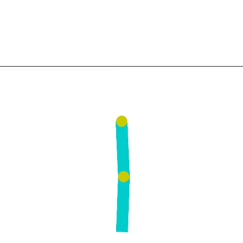
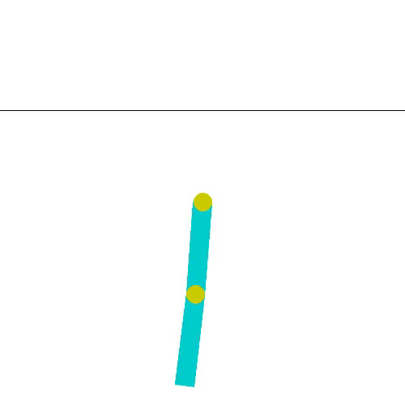
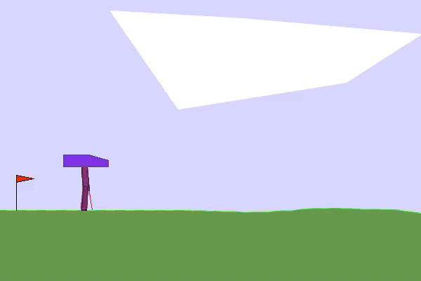
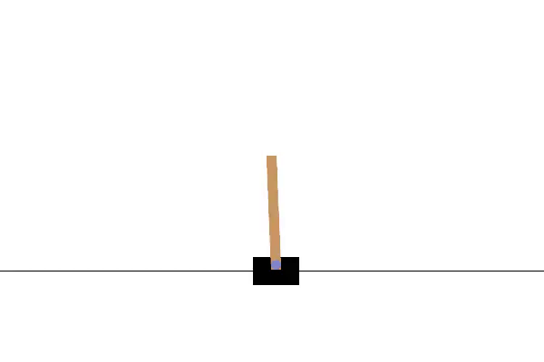
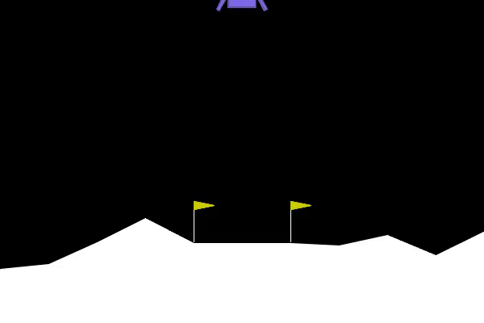
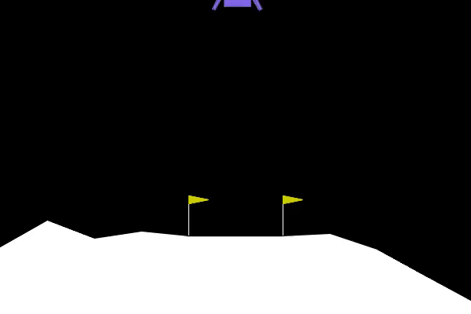
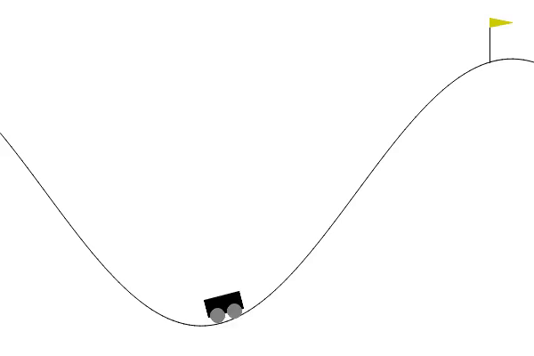
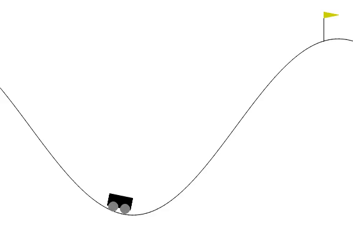

# Multi-Agent On-Policy Reinforcement Learning with Gymnasium
Training multiple on-policy agents to solve reinforcement learning environments from the Gymnasium ecosystem.

<div style="display: flex; gap: 10px; align-items: center;">
  
  
  
</div>

## Overview
This project implements and evaluates multiple on-policy reinforcement learning agents trained on environments from the Gymnasium package.
The goal of this project is to:
- Implement on-policy RL algorithms from scratch
- Train agents on classic control / Box2D / MuJoCo
- Compare training stability and sample efficiency
- Evaluate performance across different environments
- Visualize training progress and inference behavior

## My Contributions
- Implemented PPO, A2C, and Sarsa from scratch using object-oriented design
- Built the complete RL infrastructure: memory buffers, training loops, evaluation pipelines
- Designed flexible environment wrappers for reward shaping and observation modifications
- Added TensorBoard metrics tracking and automated inference video recording

## Skills and Technologies
- Reinforcement Learning: On-policy algorithms (PPO, A2C, Sarsa)
- Python: NumPy, PyTorch
- RL Tools: Gymnasium, TensorBoard
- Software Engineering: Object-oriented programming, modular design, experiment tracking
- Visualization: Matplotlib, Seaborn, GIF/video recording

## Table of Content
- [Implemented Algorithms](#implemented-algorithms)
- [Environments](#environments)
- [Project Structure](#project-structure)
- [Installation](#installation)
- [Training](#training)
  - [Configurable Parameters](#configurable-parameters)
- [Results](#results)
  - [Training Curves](#training-curves)
  - [Evaluation Performance](#evaluation-performance)
- [Inference Examples](#inference-examples)
- [Key implementations](#key-implementations)
- [Dependencies](#dependencies)
- [Experiment Tracking](#experiment-tracking)
- [Future Improvements](#future-improvements)
- [References](#references)

## Implemented Algorithms
The following on-policy algorithms are implemented:
- Sarsa
- A2C
- PPO

They share OnPolicy base class to not repeat reused logic for the policies. For each above mentioned algorithm they need to be implemented only the specifics related to:
- loss value calucation
- network specifics
- changes in training loop
- etc.

## Environments
Agents were trained on the following Gymnasium environments:
- Acrobot-v1
- CartPole-v1
- MountainCarContinuous-v0
- MountainCar-v0
- Swimmer-v5
- LunarLander-v3 Discrete
- LunarLander-v3 Continuous
- BipedalWalker-v3 Discrete
- BipedalWalker-v3 Continuous
- CarRacing-v3

You can easily swap environments via configuration.

## Project Structure
```
├── agent
│   ├── callbacks
│   ├── exploration
│   ├── mixins
│   ├── off_policy
│   ├── on_policy
│   ├── schedulers
│   └── utils
├── config
│   ├── filters
│   └── handlers
├── envs
├── evaluate
├── images
├── logs
│   ├── env_name1
│   ├── env_name2
│   ├── ...
├── memory
├── models
├── network
│   ├── backbones
│   ├── cores
│   ├── distributions
│   ├── heads
│   └── models
├── notebooks
├── tests
│   └── unit
│       └── network
│           └── data
├── utils
└── worker
```

## Installation

1. Clone the repository
```
git clone https://github.com/michal-boguslawski/Reinforcement-learning.git
cd reinforcement-learning
```
2. Create virtual environment
```
python -m venv venv
source venv/bin/activate
```
3. Install dependencies
```
pip install -r requirements.txt
```

## Training
To train an agent you need to configure <i>config/config.yaml</i> file and later run
```
python main.py
```
### Configurable Parameters
You can modify:
- learning rate
- rollout length/batch size
- minibatch size
- network configuration
- environment reward reshaping functions
- policy specifics configuration
- and many more...

## Results
### Training Curves
All training logs are available through tensorboard. The path to an example of tensorboard logs: [Car Racing Tensorboard](logs\CarRacing\tensorboard)
**Example:**

### Evaluation Performance
| Algorithm | Environment | Avg Reward | Std | Episodes | Best Version |
|-----------|------------|------------|----------|----------|----------|
| ⭐ PPO | Acrobot | -77.47 | 20.51 | 1000 | v2 |
| A2C | Acrobot | -83.33 | 26.17 | 1000 | v1 |
| Sarsa | Acrobot | -87.45 | 30.06 | 1000 | v1 |
| ⭐ PPO | BipedalWalker | 330.06 | 26.23 | 1000 | v6 |
| ⭐ PPO | CarRacing | 798.19 | 240.92 | 1000 | v2 |
| ⭐ PPO | CartPole | 500 | 0 | 1000 | v1 |
| ⭐ A2C | CartPole | 500 | 0 | 1000 | v1 |
| Sarsa | CartPole | 132.99 | 66.08 | 1000 | v1 |
| ⭐ PPO | LunarLander Discrete | 265.68 | 47.92 | 1000 | v1 |
| ⭐ PPO | LunarLander Continuous | 256.91 | 44.77 | 1000 | v1 |
| ⭐ PPO | MountainCarContinuous | 98.55 | 47.92 | 1000 | v4 |
| ⭐ PPO | Swimmer | 353.44 | 1.16 | 1000 | v3 |

## Inference Examples
<div style="display: flex; flex-wrap: wrap; gap: 10px; align-items: flex-start;">
  
  
  
  
  
  
  
  
  
  
  
  
  
  
  
  
  
  
  
  
</div>

## Key implementations
In this project, policies and the entire supporting infrastructure—including memory buffers, training loops, and evaluation pipelines—were built completely from scratch. The system was designed in an object-oriented way, making it easy to extend and integrate with a range of additional features for training, evaluation, and configuration. Key features include:
- TensorBoard metrics tracking for visualizing training progress
- Configurable policies for flexible experimentation
- Configurable environments to easily switch tasks
- Added logging ability
- Environment wrappers for reward shaping and observation modifications
- Periodic inference recording: agent behavior is saved as video at configurable intervals, making it easy to track training progress visually
- And more

## Dependencies
The project relies on several Python packages for reinforcement learning, numerical computation, and visualization. Key packages include:
- **NumPy** – numerical computations and array operations
- **PyTorch** – neural network implementation and training
- **Gymnasium** – standardized RL environments
- **Pydantic** - data validation
- **TensorBoard** – monitoring and visualizing training progress

## Experiment Tracking

Experiments were tracked using **Tensorboard**
Logging directory: logs/
To launch TensorBoard:
```
tensorboard --logdir logs\CarRacing\tensorboard
```

## Future Improvements
- [ ] Add TRPO implementation
- [ ] Add Off-policy implementations
- [ ] Add Curiosity-Driven Learning (ICM)
- [ ] Cleaning of reused code
- [ ] Tune experiments: BipedalWalker Hardcore, Car Racing
- [ ] New experiments (MuJoCo, Atari)

## References
- ["Online Q-Learning using Connectionist Systems" by Rummery & Niranjan (1994)](https://web.archive.org/web/20230627144941/https://citeseerx.ist.psu.edu/viewdoc/download?doi=10.1.1.17.2539&rep=rep1&type=pdf)
- ["Proximal Policy Optimization Algorithms" by John Schulman, Filip Wolski, Prafulla Dhariwal, Alec Radford, Oleg Klimov (2017)](https://arxiv.org/pdf/1707.06347)
- Gymnasium documentation
